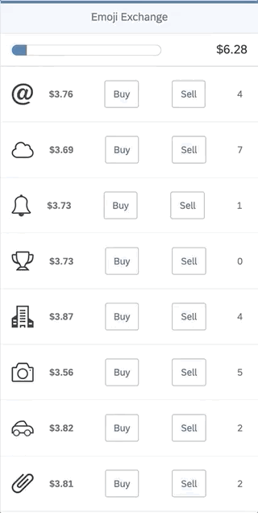

# Emoji Exchange

This is a crypto game built to learn Ethereum smart contracts.

Inspired by [Austin Griffith](https://medium.com/gitcoin/emojicoin-exchange-53f9658c9e3b)

This repository consists of three projects representing layers of the app. The front end part is built on OpenUI5.

In order to start the game locally, complete the following steps:

1. Clone the repository
2. Install Embark. Please refer to my [blog](https://blogs.sap.com/2019/08/26/develop-your-fiori-crypto-coin-using-embark-with-quorum/) for instructions
3. Go to each layer and run ```npm install```
4. In your terminal go to the **/blockchain/** folder and run ```embark simulator```
5. In the output of the previous step copy one of the generated accounts and paste it to the */middleware/src/server.ts* file as the *masterAccount* variable
6. In another terminal window go to the **/blockchain/** folder and run ```embark build```
7. In the output of the previous step copy the address, where the **MyEmojiExchange** contract has been deployed and paste it to the **/middleware/src/server.ts** file as the **deploymentAddress** variable
8. Go to the **/blockchain/dist/contracts/** folder and copy the **MyEmojiExchange.json** file
9. Go to the **/middleware/src/** folder and paste the **MyEmojiExchange.json** file
10. In another terminal window go to the **/middleware/** folder and run ```npm install```
11. In the same terminal window go to the **/middleware/** folder and run ```npm run start```
12. In another terminal window go to the **/ui/** folder and run ```npm install```
13. In the same terminal window go to the **/ui/** folder and run ```npm run local-proxy```
14. In another terminal window go to the **/ui/** folder and run ```ui5 serve -o index.html```

You should be able to see the following:


